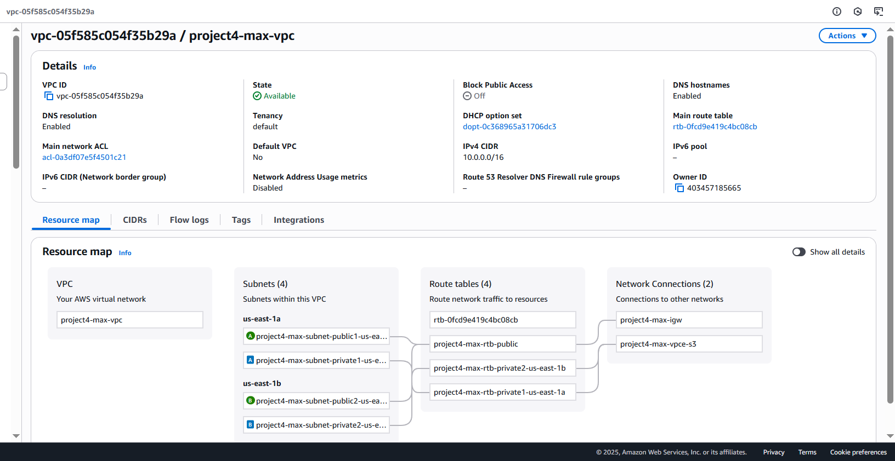
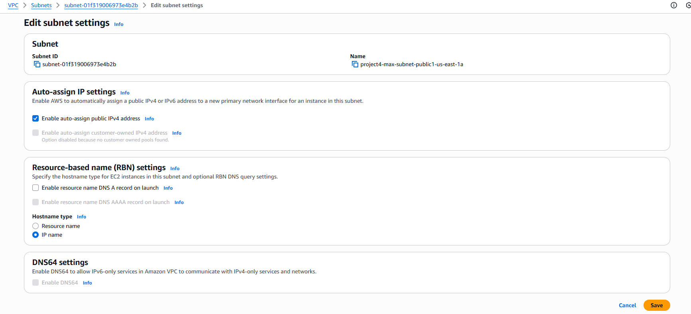
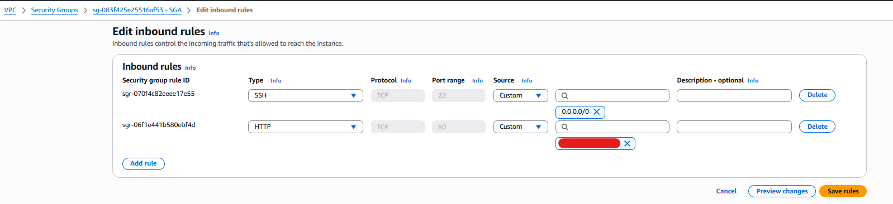
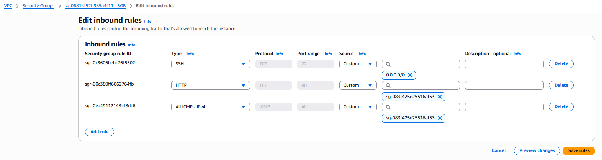
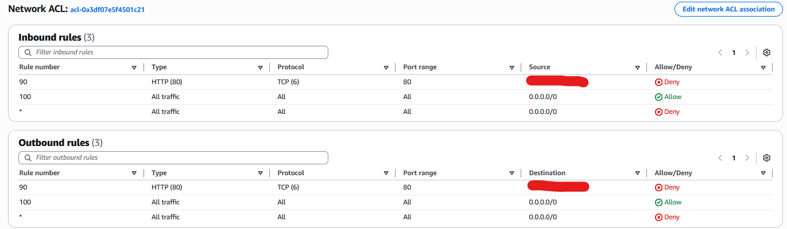
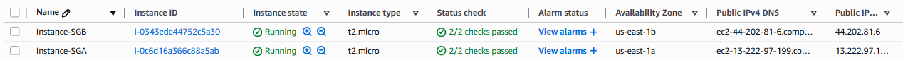
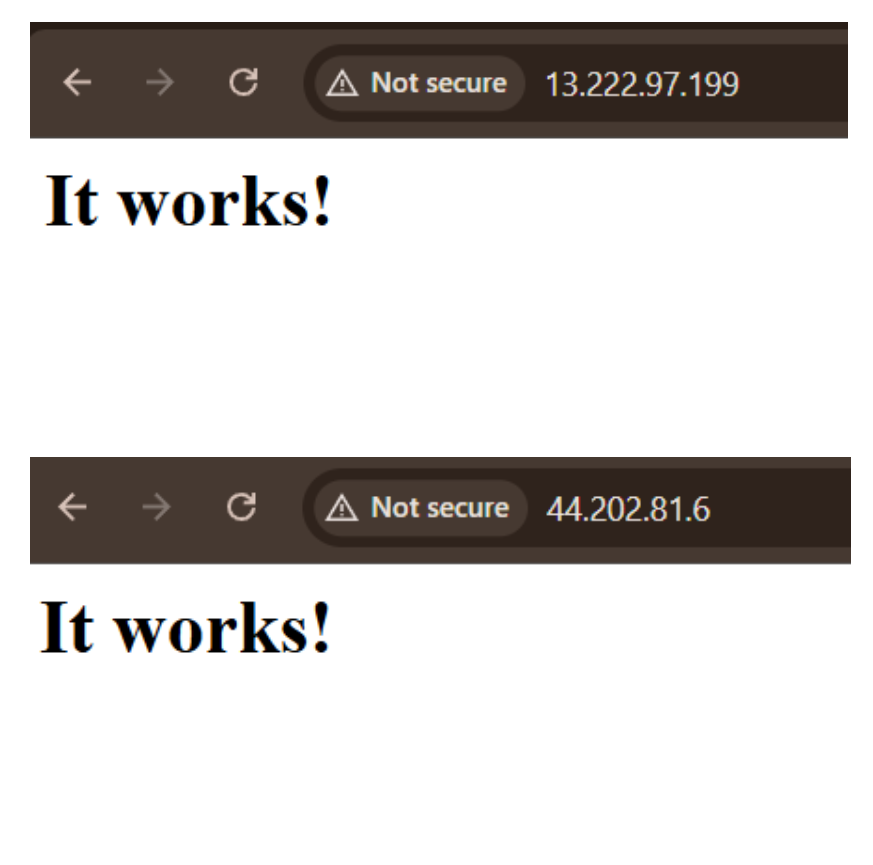
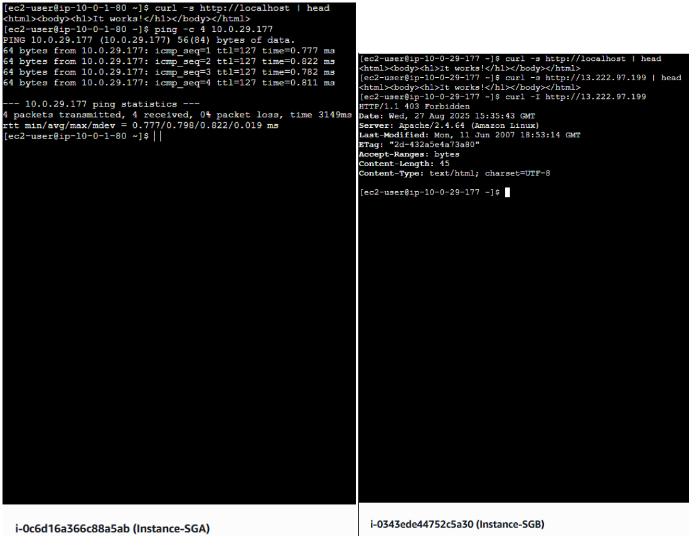

# AWS-Security-Group-NACL

# AWS Project 4 — Security Groups & NACL Challenge (Anonymized)

This project demonstrates layered network security on AWS using **Security Groups** (instance-level, stateful) and **Network ACLs** (subnet-level, stateless).  
All information here is **anonymized** — no real account IDs, instance IDs, or public IPs appear in this repo.

---

## 🗺️ Architecture (anonymized)

- **VPC CIDR:** `10.0.0.0/16`
- **Public subnets:**
  - `10.0.1.0/24` (AZ A) → hosts **Instance SGA**
  - `10.0.2.0/24` (AZ B) → hosts **Instance SGB**
- **Internet Gateway** attached; route tables configured for internet egress
- (Optional) S3 Gateway Endpoint

> All screenshots are redacted. Any IPs shown in examples use RFC 5737 documentation ranges (e.g., `203.0.113.0/24`).



---

## 🔧 Subnet configuration

Enable **Auto-assign public IPv4** for both public subnets so instances get public IPs at launch.



---

## 🔐 Security Groups

### SGA (attached to *Instance-SGA*)
- **Inbound**
  - SSH (22) — `0.0.0.0/0` *(demo; restrict to your IP in prod)*
  - HTTP (80) — `0.0.0.0/0` *(demo)*
- **Outbound** — All traffic (default)



### SGB (attached to *Instance-SGB*)
- **Inbound**
  - HTTP (80) — **Source = SGA Security Group**
  - All ICMP — **Source = SGA Security Group**
- **Outbound** — All traffic (default)



---

## 🚧 Network ACL (stateless, subnet-level)

Demonstrate subnet enforcement by blocking the developer’s home IP:

- **Inbound Rule 90** — DENY HTTP (80) **from** `<HOME_IP>/32`
- **Outbound Rule 90** — DENY HTTP (80) **to** `<HOME_IP>/32`
- Keep the usual `Allow` rules (100) and final `* Deny`.

> Use documentation IPs in the README (e.g., `203.0.113.45/32`) and your **actual** home IP only locally.



---

## 💻 EC2 instances

- **AMI:** Amazon Linux 2023
- **Type:** `t2.micro`
- **User data:** installs Apache and serves “It works!”



User data used: [`./scripts/userdata-httpd.sh`](./scripts/userdata-httpd.sh)

---

## ✅ Validation

### 1) Browser tests (from home)
- Hit SGA and SGB public IPs to confirm HTTP works.
- Example placeholders:
  - `<SGA_PUBLIC_IP>` → `203.0.113.10`
  - `<SGB_PUBLIC_IP>` → `203.0.113.11`



### 2) Terminal tests (from each instance)
- **On SGA:** `curl localhost` and `ping <SGB_PRIVATE_IP>`
- **On SGB:** `curl localhost` and `curl <SGA_PUBLIC_IP>` (observe SG/NACL effects)



Automated sanity checks:

```bash
cp variables.env.template variables.env   # fill placeholders
./scripts/validate.sh
